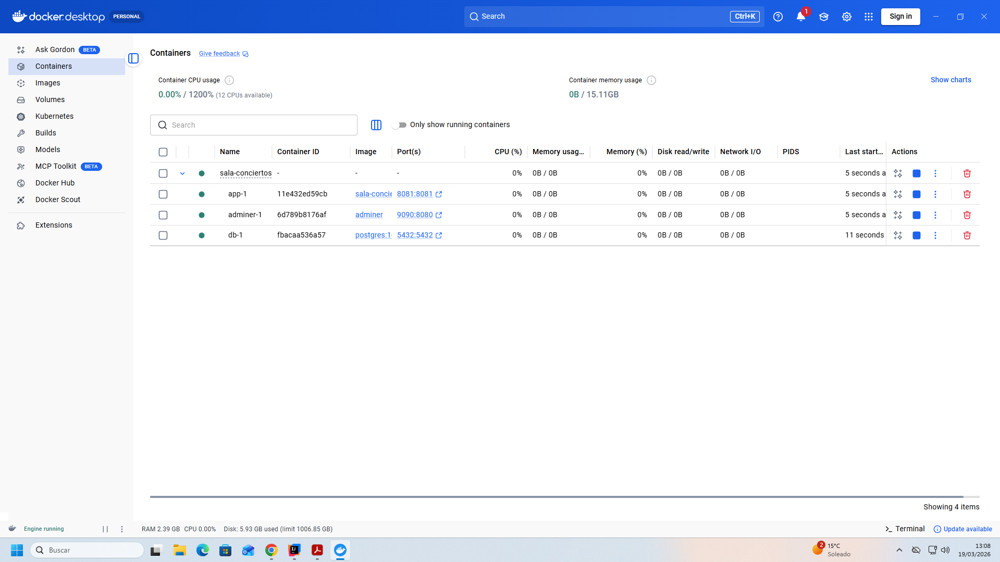
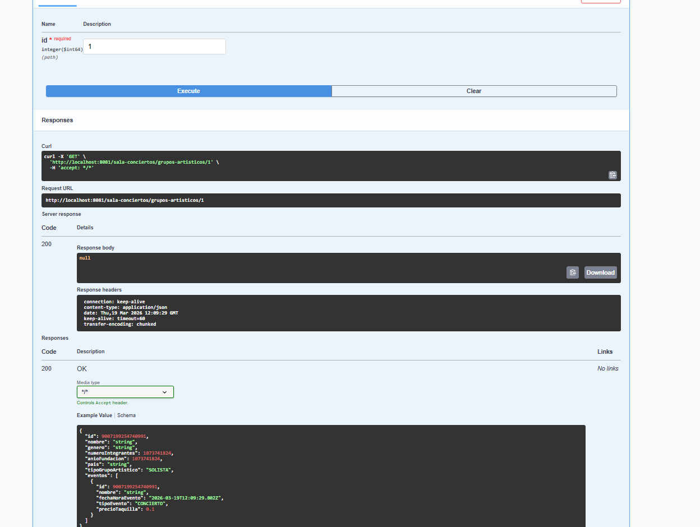

# Infraestructura Docker — Bloque A‌‌‌​‌​‌‌​‍‍​‍​​​​‍‌‌‍​‌‌‍‌‍​​‍​​‍‌‍​‌​‌‌‌‍​​‍‌​​‍​‌‍‌‍​​‌‌‍​‍

## docker-compose.yml
app:
build: .
ports:
- "8081:8081"
environment:
- SPRING_DATASOURCE_URL=jdbc:postgresql://db:5432/sala-conciertos
- SPRING_DATASOURCE_USERNAME=postgres
- SPRING_DATASOURCE_PASSWORD=secret
- SPRING_DATASOURCE_DRIVER_CLASS_NAME=org.postgresql.Driver
- SPRING_JPA_DATABASE_PLATFORM=org.hibernate.dialect.PostgreSQLDialect
- SPRING_JPA_HIBERNATE_DDL_AUTO=update
- SPRING_H2_CONSOLE_ENABLED=false
- SPRING_SQL_INIT_MODE=never
depends_on:
db:
condition: service_healthy
restart: on-failure

# Servicio 2: Base de datos PostgreSQL

db:
image: postgres:16-alpine
environment:
- POSTGRES_DB=sala-conciertos
- POSTGRES_USER=postgres
- POSTGRES_PASSWORD=secret
ports:
- "5432:5432"
volumes:
- postgres_data:/var/lib/postgresql/data
healthcheck:
test: ["CMD-SHELL", "pg_isready -U postgres"]
interval: 5s
timeout: 5s
retries: 5

# Servicio 3: Adminer (panel web para ver la BD)
adminer:
image: adminer
ports:
- "9090:8080"
depends_on:
db:
condition: service_healthy

# Volumenes (para que los datos persistan)
volumes:
postgres_data:

## Dockerfile

# Etapa 1: Compilar con Maven (como hacer mvn package)
FROM maven:3.9-eclipse-temurin-21 AS builder
WORKDIR /app
COPY pom.xml .
COPY src ./src
RUN mvn clean package -DskipTests

# Etapa 2: Ejecutar con JRE ligero (solo lo necesario)
FROM eclipse-temurin:21-jre-alpine
WORKDIR /app
COPY --from=builder /app/target/*.jar app.jar
EXPOSE 8080
ENTRYPOINT ["java", "-jar", "app.jar"]

## Evidencia

