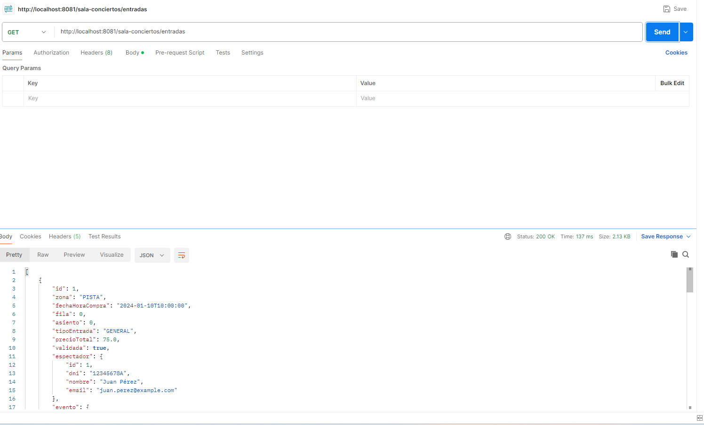

# Resultados — Bloque C‌‌‌​‌​‌‌​‍‍​‍‌​​​​​​​‌‍​‌​​​‍​​‌​​‌‌​‌‍​‌‍​​‍​‌​‌‌‌‍‌‌‌‍​‍

## Validacion de API

## Que implementaron

He implementado una base de datos en postgre y H2, una para el desarrollo en la parte de produccion y la otra para pruebas y testing.
He implemntado Docker para asi poder tener la API REST en contenedores y que funcione en distintos equipos.
He implementado Spring Boot, Lombok para crear la api.

## Evidencia


## Codigo relevante

```JAVA

    //Hacmeos un get para listar todas las entradas
 @GetMapping
    public List<Entrada> buscarTodas(){
        return entradaService.listarTodas();
    }
    
    //Hacemos un get para buscar una entrada por id
    @GetMapping("/{id}")
    public Entrada buscarPorId(@PathVariable long id){
        return entradaService.buscarPorId(id).get();
    }

    //Hacemos un get para sacar todas las entradas de una zona
    @GetMapping("/zona/{zona}")
    public List<Entrada> buscarPorZona(@PathVariable TipoZona zona){
        return entradaService.buscarPorZona(zona);
    }


```